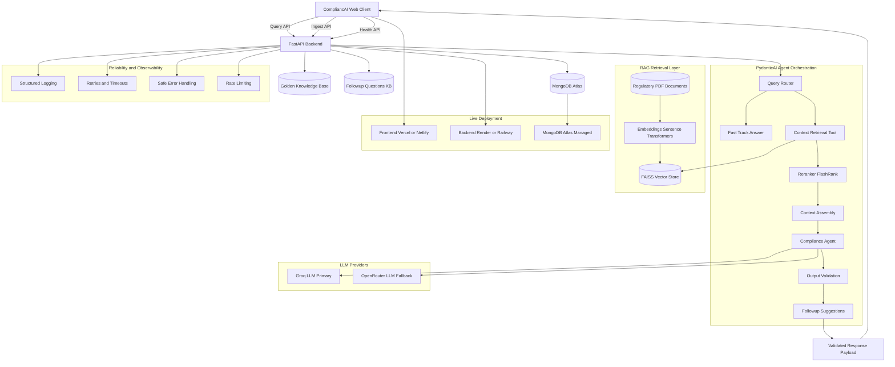

# Regulatory Compliance Assistant - RAG Application

A sophisticated AI-powered Regulatory Compliance Assistant built using specific Agentic  architecture. This application provides intelligent, conversational compliance guidance by combining large language models with a comprehensive regulatory document knowledge base.

## 🎯 Overview

The Regulatory Compliance Assistant transforms complex regulatory compliance queries into natural, conversational interactions. It analyzes compliance documents, provides accurate assessments, and maintains context across multi-turn conversations—all while citing specific regulatory sources.

### Key Features

- **🤖 Conversational AI Agent**: Natural language interactions powered by **PydanticAI** and Llama 3.3 70B (Groq) with Fallback to OpenRouter.
- **📚 Document Intelligence**: RAG-based retrieval using FAISS vector store with sentence transformers.
- **⚡ Fast Track Retrieval**: Instant answers from a curated **Golden Knowledge Base** for high-confidence matches.
- **🧠 Dynamic Reranking**: Advanced relevance scoring (**FlashRank**) to prioritize the best context.
- **🎯 Strict Compliance Assessment**: Provides structured compliance status (Compliant/Non-Compliant/Needs Review) using strict **Pydantic** output validation.
- **🔍 Smart Orchestration**: Distinguishes between initial queries, follow-ups, and clarifications using intelligent routing.
- **💬 Context-Aware Conversations**: Maintains conversation history for follow-up questions in MongoDB.
- **📖 Source Citations**: Every response includes references to specific regulatory documents.
- **🎨 Modern UI**: Clean, ChatGPT-inspired interface built with React + Vite + Tailwind CSS.

---

## 🏗️ Architecture

### Technology Stack

#### Backend
- **Framework**: FastAPI (Python 3.11+)
- **Agent Framework**: **PydanticAI** (Agentic Workflow & Validation)
- **Primary LLM**: Llama 3.3 70B Versatile (via Groq API)
- **Fallback LLM**: Gemini/OpenAI (via OpenRouter API - Free Tier)
- **Vector Store**: FAISS with Sentence Transformers (`all-MiniLM-L6-v2`)
- **Reranker**: FlashRank (Cross-Encoder)
- **Database**: MongoDB (Conversation History) / Atlas
- **Validation**: Pydantic (Strict Schema Enforcement)
- **Logging**: Loguru + Correlation ID Tracking

#### Frontend
- **Framework**: React 18 with Vite
- **Styling**: Tailwind CSS
- **Icons**: Lucide React
- **HTTP Client**: Axios
- **State Management**: React Hooks

### System Diagram



---

## 🚀 Getting Started

### Prerequisites

- **Python**: 3.11 or higher
- **Node.js**: 18.x or higher
- **MongoDB**: 4.4+ (Local or Atlas)
- **Groq API Key**: Get one from [console.groq.com](https://console.groq.com)
- **OpenRouter API Key** (Optional): For fallback support.

### Installation

1. **Clone the repository**
   ```bash
   git clone https://github.com/arvindpandey4/regulatory_compliance_assistant.git
   cd regulatory_compliance_assistant
   ```

2. **Backend Setup**
   ```bash
   cd backend
   python -m venv venv
   .\venv\Scripts\Activate.ps1  # Windows
   # source venv/bin/activate    # Linux/Mac
   
   pip install -r requirements.txt
   ```

3. **Configure Environment Variables**
   
   Create `backend/.env`:
   ```env
   GROQ_API_KEY=your_groq_api_key_here
   OPENROUTER_API_KEY=your_openrouter_key_here
   MONGODB_URL=mongodb://localhost:27017
   ```

4. **Ingest Knowledge Base** (Optional but Recommended)
   ```bash
   # Ingest the Golden Knowledge Base (Fast Track):
   cd backend
   python ingest_kb.py
   ```

5. **Frontend Setup**
   ```bash
   cd ../frontend
   npm install
   ```

### Running the Application

#### Option 1: Run All Services (Recommended)
```bash
# From project root
.\run-all.ps1
```

This starts:
- Backend API: `http://127.0.0.1:8000`
- Frontend UI: `http://localhost:5173`
- API Docs: `http://127.0.0.1:8000/docs`

#### Option 2: Run Services Separately

**Backend:**
```bash
cd backend
.\venv\Scripts\Activate.ps1
.\run.ps1
```

**Frontend:**
```bash
cd frontend
npm run dev
```

### Stopping the Application

```bash
# From project root
.\stop-all.ps1
```
This safely terminates all processes and releases the ports.

---

## 📖 Usage

1. **Open the Application**: Navigate to `http://localhost:5173`.
2. **Analysis Mode**: Ask complex questions like "Does our data retention policy comply with GDPR Article 5?". The agent will use RAG to retrieve documents and provide a formal assessment.
3. **Fast-Track Mode**: Ask common questions like "What is the maximum fine under GDPR?". If the answer exists in the Golden KB, you'll get an instant, pre-verified response.
4. **Follow-up**: Click suggested questions or ask your own to dig deeper.

---

## 🔧 API Documentation

**Interactive Docs**: `http://127.0.0.1:8000/docs`

#### `POST /api/v1/query/`
Submit a compliance query. The PydanticAI agent orchestrates the response.

**Request:**
```json
{
  "query": "Does our policy comply with GDPR?",
  "session_id": "optional-session-id"
}
```

**Response (Strict Schema):**
```json
{
  "session_id": "uuid-v4",
  "data": {
    "response": "Based on the regulatory documents...",
    "status": "Compliant|Non-Compliant|Needs Review",
    "reasoning": "Detailed technical analysis...",
    "relevant_clauses": ["GDPR Article 5(1)(e)"],
    "sources": [
      { "document_name": "GDPR_Guide.pdf", "excerpt": "...", "relevance_score": 0.92 }
    ],
    "conversation_type": "analysis",
    "follow_up_questions": ["What about data minimisation?"]
  }
}
```

---

## 🤝 Contributing

Contributions are welcome! Please follow these guidelines:
1. Fork the repository.
2. Create a feature branch.
3. Commit your changes.
4. Push to the branch.
5. Open a Pull Request.

---

## 📄 License

This project is licensed under the MIT License - see the LICENSE file for details.

---

## 👤 Author

**Arvind Pandey**

- GitHub: [@arvindpandey4](https://github.com/arvindpandey4)
- Project: [Regulatory Compliance Assistant](https://github.com/arvindpandey4/regulatory_compliance_assistant)

---

## 🙏 Acknowledgments

- **Groq**: For providing fast LLM inference.
- **PydanticAI**: For the robust agentic framework.
- **LangChain & FAISS**: For RAG foundational components.
- **FlashRank**: For ensuring high-quality retrieval.
