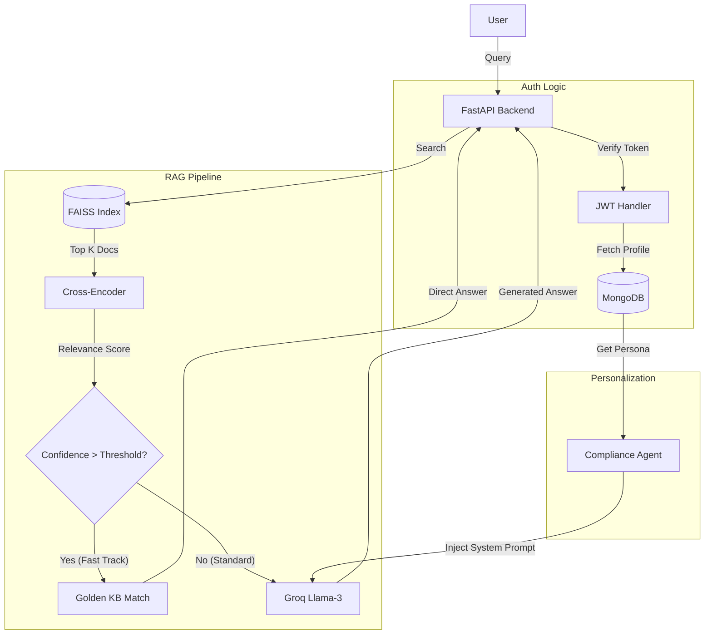

# ComplianceAI - Regulatory Compliance Assistant

[](https://compliance-ai-arvind.vercel.app/)


**ComplianceAI** is an advanced, production-grade **RAG (Retrieval-Augmented Generation)** application designed to assist auditors and compliance officers. It automates specific regulatory inquiries by cross-referencing user queries against uploaded compliance documents, specifically optimized for the *Compliance Auditing Guidelines (C&AG of India)*.

Unlike generic chatbots, ComplianceAI features a **Hybrid RAG Logic** with a "Fast Track" system for zero-latency Knowledge Base retrieval and configurable **Auditor Personas** to tailor the analysis tone.

---

## 🚀 Key Features

### 🧠 Advanced RAG Intelligence
- **Hybrid Search Architecture**: Combines dense vector retrieval (FAISS) with high-precision reranking (Cross-Encoder) for superior accuracy.
- **"Fast Track" Retrieval**: Instantly detects queries matching the Golden Knowledge Base, bypassing the LLM for faster, hallucination-free answers.
- **Context-Aware Follow-ups**: Automatically suggests relevant follow-up questions based on the retrieved context.

### 🎭 Configurable Auditor Personas
Customize the AI's behavior via Profile Settings to match your reporting needs:
- **Strict & Formal (Default)**: Adheres rigidly to regulatory text. authoritative tone.
- **Educational**: Explains the "why" behind rules, acting as a mentor.
- **Risk-Focused**: Prioritizes worst-case scenarios and penalty analysis.
- **Concise**: Delivers bulleted, executive-summary style responses.

### 💻 Modern User Experience
- **Glassmorphism UI**: A sleek, professional interface with animated backgrounds and responsive design.
- **Interactive Demo Mode**: One-click access to a pre-loaded compliance environment with a built-in **PDF Document Viewer**.
- **Persistent Sessions**: Automatically saves and manages the last 5 chat sessions per user.
- **Secure Authentication**: Full JWT-based sign-up/login system with encrypted password storage.

---

## 🛠️ Technology Stack

### Backend
- **Framework**: FastAPI (Python 3.9+)
- **LLM Engine**: LangChain + Groq API (Llama-3.70b-versatile)
- **Vector Store**: FAISS (Local) + SentenceTransformers (`all-MiniLM-L6-v2`)
- **Database**: MongoDB Atlas (User data & Chat History)
- **Reranker**: `cross-encoder/ms-marco-MiniLM-L-6-v2`

### Frontend
- **Framework**: React.js (Vite)
- **Styling**: Modern CSS3 (Glassmorphism, Animations)
- **State Management**: React Hooks + Local Storage
- **HTTP Client**: Axios with Interceptors

---

## 🏗️ Architecture Overview



---

## ⚡ Deployment & Setup

### Prerequisites
- **Python 3.9+**
- **Node.js 16+**
- **MongoDB Cluster** (Atlas or Local)
- **Groq API Key**

### 1. Verification
Clone the repository:
```bash
git clone https://github.com/yourusername/ComplianceAI.git
cd ComplianceAI
```

### 2. Backend Setup
```bash
cd backend
python -m venv venv
# Windows
.\venv\Scripts\activate
# Linux/Mac
source venv/bin/activate

pip install -r requirements.txt
```

Create a `.env` file in `/backend`:
```env
MONGODB_URI=mongodb+srv://<user>:<password>@cluster.mongodb.net/?retryWrites=true&w=majority
GROQ_API_KEY=gsk_...
SECRET_KEY=your_super_secret_jwt_key
```

### 3. Frontend Setup
```bash
cd ../frontend
npm install
```

### 4. Running the Application
We provide a unified script for Windows users:
```powershell
# From root directory
./run-all.ps1
```
Or run manually:
- **Backend**: `uvicorn main:app --reload` (Port 8000)
- **Frontend**: `npm run dev` (Port 5173)

---

## 📖 Usage Guide

1.  **Register/Login**: Create an account to access the dashboard.
2.  **Try Demo**: Click "Try Demo" to load the C&AG Guidelines instantly.
    -   Click the **"View Document"** button (top right) to read the PDF alongside the chat.
3.  **Upload Documents**: Drag & Drop your own PDF compliance documents to query them.
4.  **Change Persona**: Click your Avatar → **Profile Settings** → Select a Persona (e.g., Risk-Focused) to change how the agent answers.

---

## 📂 Project Structure

```
ComplianceAI/
├── backend/
│   ├── app/
│   │   ├── api/            # API Routes & Endpoints
│   │   ├── core/           # Auth & DB Config
│   │   ├── services/       # RAG Agent, Vector Store, Chat History
│   │   └── models/         # Pydantic Schemas
│   ├── data/
│   │   ├── faiss_index/    # Local Vector Embeddings
│   │   └── uploads/        # PDF Storage
│   └── main.py             # Entry Point
├── frontend/
│   ├── src/
│   │   ├── pages/          # Dashboard, Login, Register
│   │   └── App.jsx         # Routing
│   └── package.json
└── README.md
```

---

**Developed with ❤️ by Arvind Pandey**
